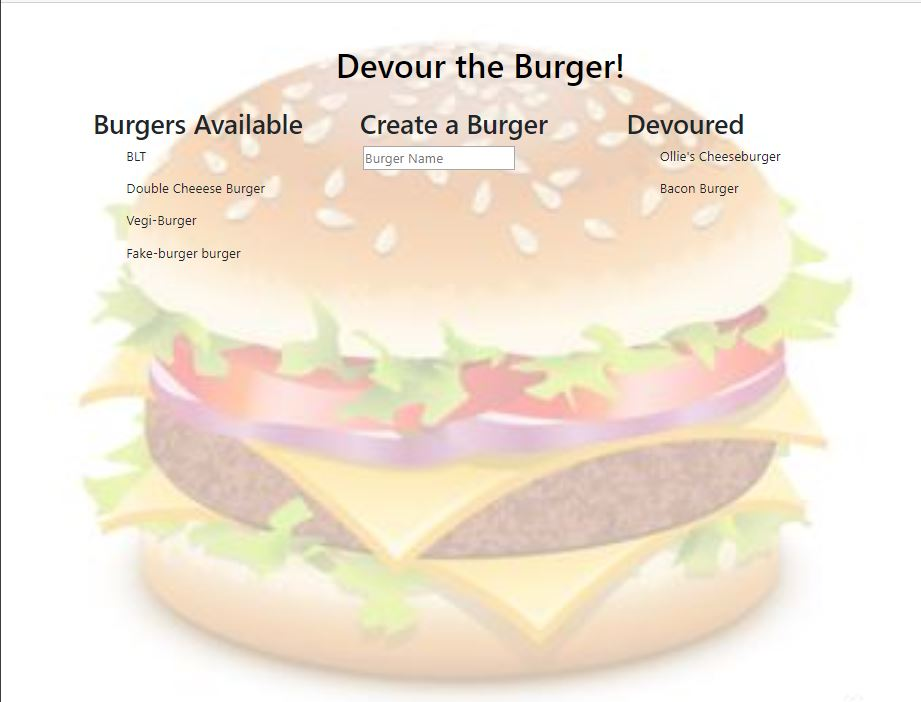
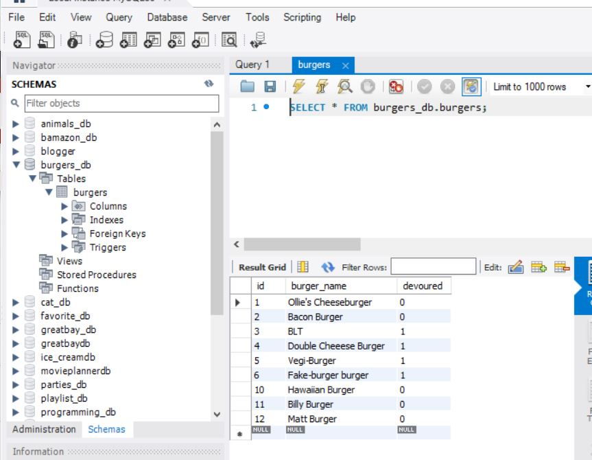

# burger
https://burgers2go.herokuapp.com/
 ## App requirements:
This App requires the following NPM packages:
Express
Express-Handlebars
MySQL
## About the App
The App uses MySQL to store the names of hamburgers and their current state of devoured or not devoured.
This App is hosted on Heroku.
## Programming that has yet to be completed

1.	Update the database to reflect the state change of the variable ‘devoured’
2. troubleshoot heroku database connection. I have the app working locally but wasn't able to get it to work on Heroku before running out of time.

## Image 1 Burger Home Page

## Image 2 Database Screenshot

